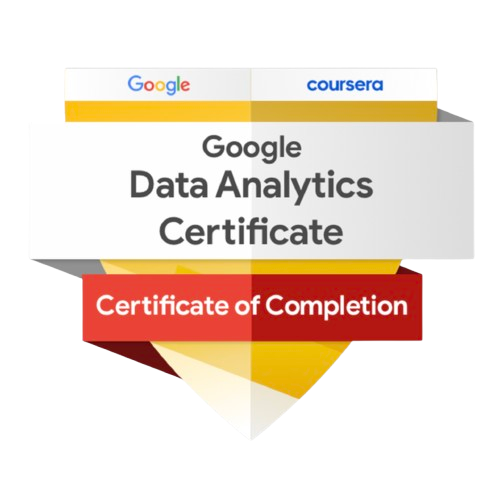

Cuento con una amplia trayectoria en el desarrollo de comunicaciones digitales, transaccionales y soluciones de Customer Communications Management (CCM), participando en la implementación de proyectos tecnológicos en entornos empresariales.

Mi experiencia se centra en el procesamiento de datos, la optimización de flujos de generación documental masiva y la automatización de procesos de alto volumen. Actualmente, complemento esta base técnica con análisis de datos y visualización orientados a la toma de decisiones.

Me interesa especialmente identificar patrones de uso, oportunidades de mejora y estrategias basadas en datos que generen valor tangible para el negocio.

------------------------------------------------------------------------

### Enfoque Profesional

- Analizo proyectos y procesos entendiendo el contexto completo, no solo los síntomas visibles.  
- Identifico causas raíz para proponer soluciones basadas en datos y evidencia.  
- Optimizo procesos automatizados enfocados en eficiencia operativa, reducción de riesgo y cumplimiento de SLA.  
- Tomo decisiones apoyado en análisis de datos, métricas y pruebas.  
- Desarrollo soluciones escalables y mantenibles, alineadas a necesidades de negocio y crecimiento futuro.  

---

### Especialización en Data Analytics aplicado CCM & Business

Mi trayectoria en soluciones documentales se complementa con una evolución hacia el análisis de datos orientado a la toma de decisiones y la optimización de procesos:

- Extracción, validación, transformación y análisis de datos mediante SQL.  
- Análisis exploratorio (EDA), limpieza y visualización de datos con R.  
- Automatización de tareas y procesamiento de datos mediante Python.  
- Uso de hojas de cálculo y herramientas de visualización como Tableau y Power BI.  

---

### Google Data Analytics Professional Certificate

Certificación profesional enfocada en el ciclo completo de análisis de datos: limpieza, transformación, análisis exploratorio y visualización, utilizando herramientas como Excel, SQL, R y Tableau.

Emitido por Google a través de plataforma coursera.

{fig-align="left" width="140"}

Id de Credencial: [LTZGJ0VGGV76](https://www.coursera.org/account/accomplishments/specialization/LTZGJ0VGGV76)

------------------------------------------------------------------------