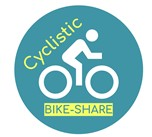

```{r}
#| label: config
#| echo: false
#| message: false
#| warning: false

# Cargamos las librerías que vamos a utilizar

library(tidyverse) # Librería para análisis, visualización, transformación.
library(patchwork) # Librería con funcionalidad para disposición de gráficos.
library(scales) # Librería para configuraciones visuales de ggplot2
library(knitr) # Librería Para informes dinámicos 
library(kableExtra) # Librería Estilizar y mejorar apariencia de las tablas
library(here) # Estructura de carpetas desde el directorio raíz del proyecto

# Carga de resúmenes processed cyclistic

meta <- read_csv(
  here("data", "processed", "cyclistic", "metadata.csv"),
  show_col_types = FALSE
)

rows_loaded <- meta$rows_loaded[1]
rows_deleted <- meta$rows_deleted[1]
pct_deleted <- rows_deleted / rows_loaded * 100
rows_clean <- meta$rows_clean[1]
rows_routes_del <- meta$rows_deleted_r[1]
rows_routes_clean <- meta$rows_clean_r[1]

summary_duration <- read_csv(
  here("data", "processed", "cyclistic", "summary_duration.csv"),
  show_col_types = FALSE
)
summary_hour_trips <- read_csv(
  here("data", "processed", "cyclistic", "summary_hour_trips.csv"),
  show_col_types = FALSE
)
summary_user_bike <- read_csv(
  here("data", "processed", "cyclistic", "summary_user_bike.csv"),
  show_col_types = FALSE
)
summary_user <- read_csv(
  here("data", "processed", "cyclistic", "summary_user.csv"),
  show_col_types = FALSE
)
summary_week_day <- read_csv(
  here("data", "processed", "cyclistic", "summary_week_day.csv"),
  show_col_types = FALSE
)
summary_season <- read_csv(
  here("data", "processed", "cyclistic", "summary_season.csv"),
  show_col_types = FALSE
)
summary_round_trip <- read_csv(
  here("data", "processed", "cyclistic", "summary_round_trip.csv"),
  show_col_types = FALSE
)
summary_top_routes <- read_csv(
  here("data", "processed", "cyclistic", "summary_top_routes.csv"),
  show_col_types = FALSE
)
summary_routes_uni <- read_csv(
  here("data", "processed", "cyclistic", "summary_routes_uni.csv"),
  show_col_types = FALSE
)


knitr::opts_chunk$set(include = TRUE, warning = FALSE, message = FALSE)
```

{.fixed-image fig-align="right"}

## Análisis de comportamiento de usuarios

### Introducción.

Este proyecto analiza el comportamiento de usuarios de un sistema de bicicletas compartidas (Cyclistic) con el objetivo de identificar diferencias de uso entre **usuarios casuales y miembros anuales.**

El reto del negocio consiste en comprender estos patrones para diseñar estrategias que incrementen la conversión de usuarios ocasionales en membresías anuales.

Para ello trabajé con más de **5 millones de registros de datos históricos**, aplicando un proceso estructurado de análisis que incluyó:

-   La ingesta y unificación de datos mensuales.\
-   Limpieza y transformación de variables temporales.\
-   Análisis exploratorio y generación de métricas.\
-   Visualización e interpretación enfocada a estrategias.

El análisis sigue una estructura basada en las 6 fases del proceso analítico de Google (preguntar, preparar, procesar, analizar, compartir y actuar). La pregunta central del análisis fue:

**¿Cómo utilizan el servicio los miembros anuales en comparación con los usuarios ocasionales?**

### Definición del Problema de Negocio

El objetivo estratégico es comprender las diferencias entre tipos de usuario casuales y miembros anuales, con el fin de identificar oportunidades que permitan incrementar la conversión a membresias anuales.

Para estructurar el análisis se plantearon las siguientes preguntas:

1.  ¿Existen diferencias en la duración promedio de los viajes entre ambos tipos de usuario?
2.  ¿cuál es la variación en el uso del servicio de los usuarios durante el año?
3.  ¿Qué comportamientos existen durante los días de la semana?
4.  ¿Cómo varia el uso del servicio durante el día?
5.  ¿Cuáles son las rutas (Origen-Destino) más utilizadas?

### Preparación de Datos

Los datos utilizados corresponden a un histórico anual (enero-diciembre 2025) del sistema de bicicletas compartidas de chicago, publicados por **Motivate International Inc.** bajo [licencia pública.](https://divvybikes.com/data-license-agreement)

El conjunto de datos incluye:

-   Identificador único de viaje\
-   Tipo de bicicleta\
-   Fecha y hora de inicio y fin\
-   Estación de origen y destino\
-   Coordenadas geográficas\
-   Tipo de usuario (miembro o casual)

Estas variables permiten analizar patrones de uso, frecuencia, variación y comportamiento temporal por segmento de usuario.

#### Consideraciones y Limitaciones

-   No se dispone de datos demográficos, por lo que el análisis se limita a comportamiento observable.\
-   Se identificaron valores faltantes en algunas estaciones de origen y destino.
-   Se detectaron registros con duraciones inconsistentes que requirieron limpieza posterior.

El volumen total del conjunto de datos supera los 5 millones de registros, lo que requirió estructurar un proceso de preparación semiautomatizado.

### Procesamiento de datos

En el proyecto completo se unificaron 12 archivos mensuales y se aplico un pipeline de limpieza y transformación para obtener un dataset consistente para análisis. El procesamiento se ejecuta mediante un script independiente para mantener el sitio ligero y reproducible.

#### Principales transformaciónes.

-   Conversión y estandarización de **started_at y ended_at**.\
-   Cálculo de duración de viaje (**ride_length**, minutos).\
-   Generación de variables temporales **(month, day_of_week, hour15min)**
-   Creación de variables auxiliares para el análisis de rutas.

#### Validaciónes y limpieza aplicada.

-   Eliminación de registros con valores de coordenadas y estación de destinos faltantes.\
-   Eliminación de viajes con duración menor a 1 minuto (falsos arranques).\
-   Conservación de viajes extremos para exploración (sin exclusión de outliers en esta etapa).

#### Datos del proceso.

-   La carga de registros iniciales `r scales::comma(rows_loaded)`.\
-   Exclusión de registros tras proceso de limpieza `r scales::comma(rows_deleted)`, lo que representa un `r comma(pct_deleted)` de los registros.\
-   Registros totales del conjunto para análisis `r scales::comma(rows_clean)`

Las variables temporales **started_at y ended_at** fueron estandarizadas durante la ingesta (ymd_hms), asegurando consistencia entre archivos.

El pipeline completo puede consultarse en el script **build_case_cyclistic.R**

```{r}
#| label: process-clean-fragme
#| echo: true
#| eval: false


df_clean <- df |> 
  mutate(
    ride_length = as.numeric(round(difftime(ended_at, started_at, units = "mins"), 2)),
    month = month(started_at, abbr = FALSE),
    day_of_week = wday(started_at, week_start = 1),
    hour15min = (round((hour(started_at) * 60 + minute(started_at)) / 15) * 15) / 60,
    route = paste(start_station_id, end_station_id, sep = "-")
  ) |> 
  filter(
    !is.na(end_lat),
    ride_length >= 1
  )
```

### Análisis Exploratorio

En esta sección se comparan patrones de uso entre usuarios miembros y usuarios casuales a través de duración del viaje, estacionalidad, distribución semanal y distribución horaria. Se priorizan métricas robustas (mediana y percentiles) para evitar sesgos por valores atípicos.

1.  La duración típica de viajes (mediana) es mayor en usuarios casuales que en usuarios miembro, esto sugiere que existe un propósito distinto en el uso del servicio entre segmentos de usuario.

```{r}
#| label: plot-summary_duration
#| echo: true

summary_duration |> 
  ggplot(aes(member_casual, med_ride_length, fill = rideable_type)) +
  geom_col(position = "Dodge") +
  labs(
    title = "Duración típica del viaje",
    x = "Tipo de usuario",
    y = "Minutos"
  ) +
  theme_minimal()
```

2.  Se identificaron viajes extremadamente largos (\>1000 min), presentes principalmente en usuarios casuales. Estos registros sugieren corresponder a bicicletas robadas, extraviadas o entregas olvidadas por parte de los usuarios.

```{r}
#| label: plot-summary_duration-P999
#| echo: true

summary_duration |> 
  ggplot(aes(member_casual, p99_ride_length, fill = rideable_type)) +
  geom_col(position = "Dodge") +
  labs(
    title = "Duración alta de viajes inflada por (outliers)",
    x = "Tipo de usuario",
    y = "Minutos",
    fill = "Tipo de bicicleta"
  ) +
  theme_minimal()
```

3.  Se identifica una preferencia por el uso de las bicicletas eléctricas por parte de los usuarios.

```{r}
#| label: plot-summary_user_bike
#| echo: true

summary_user_bike |> 
  ggplot(aes(member_casual, percentage, fill = rideable_type)) + 
  geom_col() +
  labs(
    title = "Preferencias de bicicletas x tipo de Usuario",
    x = "Tipo de usuario",
    y = "%  de viajes",
    fill = "Tipo de Bicicleta"
  )
```

4.  El verano concentra la mayor cantidad de viajes mientras que el invierno registra una baja considerable en el uso del servicio. Los miembros presentan una mayor consistencia durante el año, por el contrario, los casuales son más sensibles a la estacionalidad principalmente durante el invierno.

```{r}
#| label: plot-summary_season
#| echo: true

summary_season |> 
  mutate(
    season = case_when(
      month %in% c(12, 1, 2) ~ "Invierno",
      month %in% c(3, 4, 5) ~ "Primavera",
      month %in% c(6, 7, 8) ~ "verano",
      month %in% c(9, 10, 11) ~ "Otoño"
    )  
  ) |> 
  ggplot(aes(season, tot_trips, fill = member_casual)) +
  geom_col() +
  labs(
    title = "Viajes por estación del año",
    x = "Estación del año",
    y = "Cantidad de viajes"
  ) +
  theme_minimal()

```

5.  Entre semana predominan los usuarios miembro en el uso del servicio manteniendo una consistencia, en contraste, los usuarios casuales presentan un aumento en el uso del servicio rumbo a el fin de semana, esto sugiere un uso recreativo por parte de los usuarios casuales y uno más habitual por parte de los miembros.

```{r}
#| label: plot-summary_week_day
#| echo: true

summary_week_day |> 
  ggplot(aes(day_of_week, tot_trips, fill = member_casual)) +
  geom_col(position = "dodge", width = 1) +
  labs(
    title = "Viajes por día de la semana",
    x = "Día de la semana",
    y = "Total de Viajes",
    fill = "Tipo de usuario"
  ) +
  scale_x_continuous(
    breaks = 1:7,
    labels = c("Lun", "Mar", "Mie", "Jue", "Vie", "Sab", "Dom")
  ) +
  scale_y_continuous(labels = label_comma()) +
  theme_minimal()
```

6.  Los miembros presentan dos picos consistentes (mañana y tarde), los casuales concentran actividad vespertina consistente, lo que refuerza la hipótesis del uso del servicio como medio de movilidad por parte de los miembros y un uso recreativo por parte de los casuales.

```{r}
#| label: plot-summary_hour
#| echo: true

summary_hour_trips |> 
  ggplot(aes(hour15min, tot_trips)) +
  geom_line(linewidth = 1) +
  facet_wrap(~member_casual) +
  scale_y_continuous(labels = label_comma()) +
  scale_x_continuous(breaks = seq(0, 24, 2)) +
  labs(
    title = "Distribución de viajes x hora del día",
    x = "Hora del día",
    y = "Cantidad de Viajes"
  )
```

7.  Las rutas de viaje más utilizadas son distintas entre tipos de usuario, lo que sugiere que corresponden a distintas zonas de la Ciudad de Chicago.

**Nota:** Para analizar las rutas de viaje, se eliminaron del conjunto de datos `r comma(rows_routes_del)`, con valores "NA" en las variables de Origen-Destino, para no sesgar nuestro análisis.

```{r}
#| label: plot-summary_routes
#| echo: true
summary_top_routes |> 
  ggplot(aes(tot_trips, reorder(route, tot_trips), fill = member_casual),) +
  geom_col(position = "dodge", show.legend = FALSE) +
  labs(
    title = "Top 15 - Rutas de viaje",
    y = "Rutas de viaje",
    x = "Cantidad de viajes",
  ) +
  facet_wrap(~ member_casual, scales = "free_y" ) +
  theme(legend.position = "top")
```

8.  Identifiqué que existe un segmento de usuario que realiza viajes redondos, las limitaciones de los datos no me permiten análizar con mayor profundidad, pero esto sugiere un posible potencial de conversión de usuarios.

```{r}
#| label: plot-summary_routes_round
#| echo: true

summary_round_trip |> 
  ggplot(aes(member_casual, tot_trips, fill = round_trip)) +
  geom_col(position = "dodge") +
  labs(
    x = "Tipos de usuario",
    y = "Cantidad de viajes",
    fill = "Tipos de viaje"
  )
```

### Hallazgos Clave

Los siguientes resultados resumen los principales patrones de uso del servicio por tipo de usuario, con el objetivo de identificar diferencias que permitan orientar estrategias de conversión de usuarios casuales hacia membresías anuales.

```{r}
#| label: table-summary
#| echo: false

tabla <- tibble(
  Elemento = c(
    "Fuente de datos",
    "Total de viajes cargados",
    "Periodo analizado",
    "Total de viajes analizados",
    "Tipos de usuario",
    "Tipos de bicicleta",
    "Variables temporales",
    "Variable de ruta",
    "Métrica principal",
    "Limpieza aplicada",
    "Total de viajes para análisis de ruta",
    "Limpieza aplicada para análisis de ruta"
  ),
  Descripción = c(
    "Cyclistic Bike-Share",
    format(rows_loaded, big.mark = ","),
    "Enero–Diciembre 2025",
    format(rows_clean, big.mark = ","),
    "Miembros y Casuales",
    "Clásica y Eléctrica",
    "Mes, día de la semana y hora(15min) ",
    "Clave compuesta Ori-Dest",
    "Duración del viaje (minutos)",
    paste("Eliminación de",
          format(rows_deleted, big.mark = ","),
          "registros con NA críticos y viajes < 1 minuto",
          sep = " "),
    format(rows_routes_clean, big.mark = ","),
    paste("Eliminacion de",
          format(rows_routes_del, big.mark = ","),
          "registros con valores ausentes Orig-Dest")
  )
)
kable(tabla, caption = "Resumen de Conjunto de datos Cyclistic") |> 
  kable_styling(
    full_width = FALSE,
     bootstrap_options = c("striped", "bordered")
  ) |> 
row_spec(0, bold = TRUE, background = "#00BFA5", color = "white")

```


#### Insight 1: Los miembros anuales dominan el uso en el servicio Bike-Share

-   Los usuarios con membresía anual realizan significativamente más viajes que los usuarios casuales.

-   Esto sugiere un uso recurrente del servicio como un medio de transporte habitual.


```{r}
#| label: plot-summary_user_bike_fin
#| echo: false

summary_user_bike |> 
  ggplot(aes(member_casual, tot_trips,)) + 
  geom_col(aes(fill = member_casual) ) +
  labs(
    title = "Total de viajes por tipo de usuario",
    x = "Tipo de usuario",
    y = "Cantidad viajes",
  ) +
    scale_fill_manual(
    values = c("member" = "#009E73",
               "casual" = "#CC79A7"
    ),
    name = "Tipo de usuario"
  ) +
  scale_y_continuous(labels = label_comma())
```


#### Insight 2: Los usuarios prefieren el uso de las bicicletas eléctricas Bike-Share

-   Más del 60% de viajes totales se realizan con bicicletas eléctricas**, superando ampliamente a las bicicletas clásicas.

-   Observamos una necesidad por desplazamientos más rápidos y con menor esfuerzo físico por parte de los usuarios.


```{r}
#| label: plot-summary_user_type_bike_fin
#| echo: false

pct_casual <- summary_user_bike |> 
  filter(member_casual == "casual", rideable_type == "electric_bike") |> 
  select(percentage)

pct_member <- summary_user_bike |> 
  filter(member_casual == "member", rideable_type == "electric_bike") |> 
  select(percentage)

summary_user_bike |> 
  ggplot(aes(member_casual, percentage, fill = rideable_type)) + 
  geom_col() +
  labs(
    title = "Proporción de viajes\npor tipo de bicicleta",
    x = "Tipo de usuario",
    y = "%  de viajes\nrealizados",
  ) + 
  scale_y_continuous(breaks = seq(0, 100, 10)) +
  scale_fill_manual(
    values = c("electric_bike" = "#009E73",
               "classic_bike" = "#CC79A7"
    ),
    name = "Tipo de bicicleta"
  ) +
  annotate(geom = "text", x = 1, y = as.double(pct_casual) / 2, label = paste0(round(pct_casual), "%"), fontface = "bold", size = 12, color = "#F0E442") + 
  annotate(geom = "text", x = 2, y = as.double(pct_member) / 2, label = paste0(round(pct_member), "%"), fontface = "bold", size = 12, color = "#F0E442" ) +
  theme_minimal()

```

#### Insight 3: La duración de viajes de usuarios casuales suele ser mayor que los usuarios miembro

-   La duración típica de viajes de usuarios casuales suele ser mayor, especialmente en el uso de bicicletas clásicas.

-   Esto sugiere que los usuarios miembro hacen un uso más cotidiano del servicio mientras que los casuales uno más recreativo especialmente en el uso de bicicletas clásicas.

```{r}
#| label: plot-summary_duration_fin
#| echo: false

summary_duration |> 
  ggplot(aes(member_casual, med_ride_length, fill = rideable_type)) +
  geom_col(position = "Dodge") +
  labs(
    title = "Duración típica del viaje",
    x = "Tipo de usuario",
    y = "Minutos"
  ) +
  scale_fill_manual(
    values = c("electric_bike" = "#009E73",
               "classic_bike" = "#CC79A7"
    ),
    name = "Tipo de bicicleta"
  ) +
  theme_minimal()
```

#### Insight 4: Miembros dominan el uso del servico entre semana

-   Los usuarios miembros presentan un uso predominante durante los días laborables, lo que sugiere dependencia del servicio como medio de transporte cotidiano.

-   Por el contrario, los usuarios casuales incrementan significativamente su actividad durante fines de semana, lo que indica un uso orientado al ocio y actividades recreativas.

```{r}
#| label: plot-summary_week_day_fin
#| echo: false

summary_week_day |> 
  ggplot(aes(day_of_week, tot_trips, fill = member_casual)) +
  geom_col(position = "dodge", width = 1) +
  labs(
    title = "Viajes por día de la semana",
    x = "Día de la semana",
    y = "Total de Viajes",
  ) +
  scale_x_continuous(
    breaks = 1:7,
    labels = c("Lun", "Mar", "Mie", "Jue", "Vie", "Sab", "Dom")
  ) +
  scale_y_continuous(
    labels = label_comma()
  ) +
  scale_fill_manual(
    values = c("member" = "#009E73",
               "casual" = "#CC79A7"
    ),
    name = "Tipo de usuario"
) +
  theme_minimal()
```

#### Insight 5: Los horarios más habituales en el uso del servicio

-   Los usuarios miembros presentan dos picos claros de uso durante la mañana y la tarde, lo que sugiere un uso del servicio como medio de transporte cotidiano hacia actividades laborales o educativas.

-   En contraste, los usuarios casuales concentran su actividad en horas vespertinas, lo que indica un uso predominantemente recreativo o social.

```{r}
#| label: plot-summary_hour_fin
#| echo: false

summary_hour_trips |> 
  ggplot(aes(hour15min, tot_trips)) +
  geom_line(aes(color = member_casual),linewidth = 1, show.legend = FALSE) +
  facet_wrap(~member_casual) +
  scale_y_continuous(labels = label_comma()) +
  scale_x_continuous(breaks = seq(0, 24, 2)) +
  labs(
    title = "Viajes por hora del día",
    x = "Hora del día",
    y = "Cantidad de Viajes"
  ) +
  scale_color_manual(
    values = c("member" = "#009E73",
               "casual" = "#CC79A7"
    ),
    name = "Tipo de usuario"
  ) +
  theme_minimal()
```

#### Conclución final

Los datos indican que los usuarios casuales no adquieren membresías anuales debido a la baja recurrencia de uso, motivo por el cual no se justificaría un gasto fijo mensual o anual. Esta brecha marca una distinción contundente en el modelo de consumo: el uso esporádico y recreativo frente a la habitualidad del transporte vinculado a desplazamientos laborales o educativos.

### Recomendaciones

Los usuarios casuales realizan viajes más largos y presentan mayor variabilidad, lo que implica un mayor costo acumulado por uso individual. Se recomienda implementar incentivos basados en uso acumulado que faciliten la transición hacia una membresía anual.

-   Descuento en membresía tras alcanzar cierto número de viajes

-   Bonificación por minutos acumulados

-   Comunicación personalizada destacando ahorro potencial

Este enfoque permite convertir a los usuarios casuales de alta actividad, para quienes el beneficio económico de la membresía resulta evidente.
